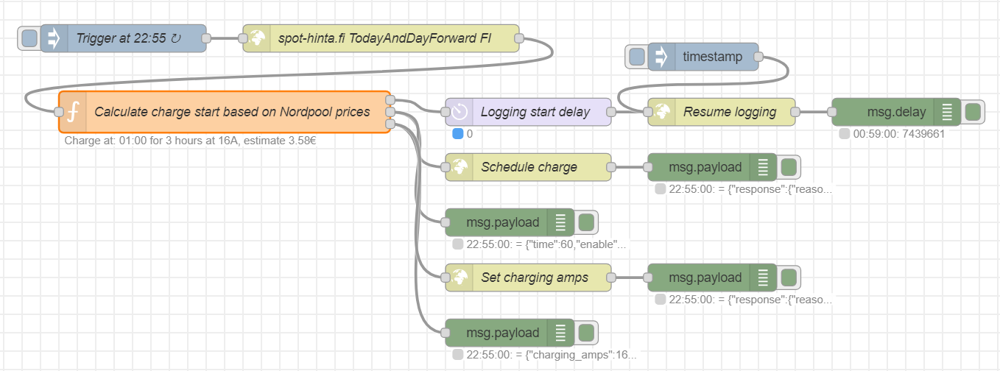

# Optimize Tesla charging on Nordpool spot prices, utilizing the TeslaMateAPI

The objective is to optimize Tesla charging based on Nordpool spot electricity prices, incorporating the following features:
   * The charging window is set between 23:00 and 07:00, spanning 8 hours
   * The automation identifies the most cost-effective contiguous time period within the charging window
   * Charge duration is estimated based on the current battery level and ambient temperature (the battery heater is required below 0°C)
   * Charging is controlled using the scheduled charging feature
   * In the event of a failure in determining the charge start time, 23:00 is used as a fallback
   * A charge is scheduled only if, at the time of execution, the car is:
      * At home
      * Plugged in
      * Not charging; in other words, it must be scheduled to start at the earliest at 23:00

This is implemented as a Node-RED flow, built on
   * TeslaMate
   * TeslaMateAPI
   * Node-RED
   * NPM packages ```nordpool``` and ```js-linq```



# Setup

## TeslaMate

Obviously you need a working TeslaMate setup, running on Docker Compose. I run mine on Raspberry P 4.

Set up a geofence for your home charger location.

## TeslaMateAPI

Install TeslaMateAPI based on the instructions on this repository: https://github.com/tobiasehlert/teslamateapi

The docker-compose.yml snippet from my installation
   * ```ENCRYPTION_KEY``` has the same value as ENCRYPTION_KEY of the teslamate container in the same file
   * ```API_TOKEN``` is the secret token used in the Node-RED flow
   * ```TZ```, use your own time zone

```
  teslamateapi:
    image: tobiasehlert/teslamateapi:latest
    restart: always
    depends_on:
      - database
    environment:
      - ENCRYPTION_KEY=***
      - DATABASE_USER=teslamate
      - DATABASE_PASS=secret
      - DATABASE_NAME=teslamate
      - DATABASE_HOST=database
      - MQTT_HOST=mosquitto
      - TZ=Europe/Helsinki
      - API_TOKEN=***
      - ENABLE_COMMANDS=true
      - COMMANDS_CHARGING=true
    ports:
      - 4001:8080
```

## Node-RED

Install Node-RED based on the instructions on this document: https://docs.teslamate.org/docs/integrations/Node-RED

The docker-compose.yml snippet from my installation
   * ```TZ```, use your own time zone

```
  node-red:
    image: nodered/node-red:latest
    restart: always
    environment:
      - TZ=Europe/Helsinki
    volumes:
      - node-red-data:/data
    ports:
      - 1881:1880

volumes:
  node-red-data:
```

The file ```add-nr-modules.sh```, add ```nordpool``` and ```js-linq```

```
#!/bin/sh

MODULES="node-red-contrib-calc
node-red-contrib-simpletime
node-red-dashboard
node-red-node-email
node-red-contrib-telegrambot
node-red-node-ui-table
nordpool
js-linq"
set -x
for MODULE in $MODULES
do
docker compose exec -T node-red npm install --no-audit --no-update-notifier --no-fund --save --prefix=/data --production $MODULE
done
docker compose stop node-red
docker compose start node-red
```

## The Node-RED flow

Import the file ```nordpool-teslamateapi.json``` into Node-RED. This will create a new flow, with the nodes in the picture
   * Edit the node 'Trigger at 22:55' to set the charge window start. The scheduled time should be 5 minutes before full hour
   * Edit the node 'Schedule charge', and enter the ```API_TOKEN``` value into the 'Token' field
   * Edit the node 'Calculate charge start based on Nordpool prices' to set your preferences
   * _The file ```nordpool-teslamateapi.js``` is just the source code of the 'Calculate charge start based on Nordpool prices' node_

The purpose of the 'Resume logging' node is to enhance TeslaMate's accuracy in logging charges. The workflow involves scheduling a 'resume logging' action in TeslaMate one minute before the charge begins. This step is crucial as, without it, TeslaMate might miss capturing several minutes at the start of the charging process.

### Test the flow

Click on the blue button on the left side of the trigger node
   * If the car is not plugged in at home, in charge stopped state, the 'Calculate charge start based on Nordpool prices' node will show 'Not plugged in at home...' status
   * If the car is ready to be scheduled, the node should first show 'Fetching Nordpool prices', and then the scheduled charge start time

